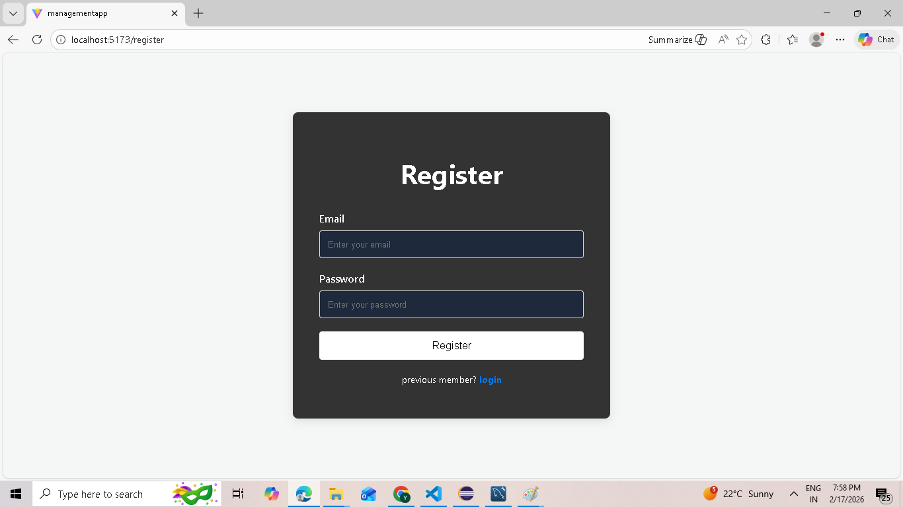
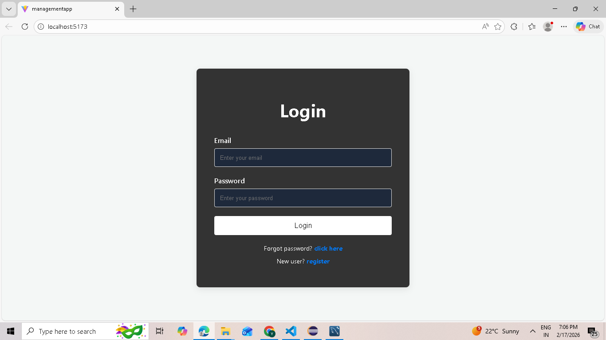
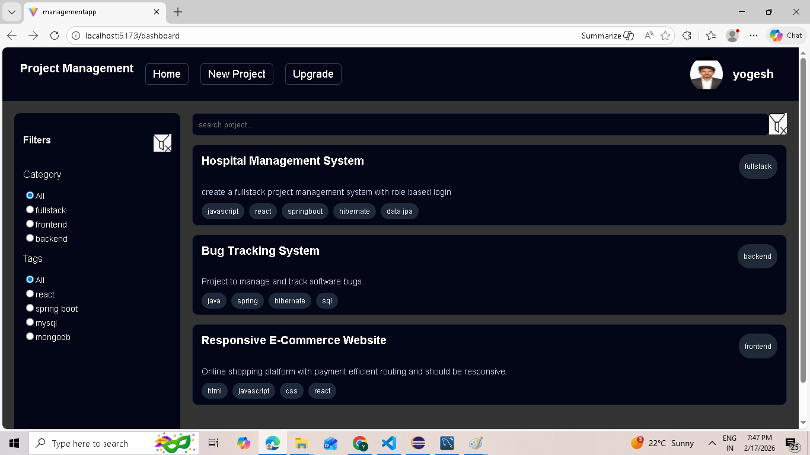
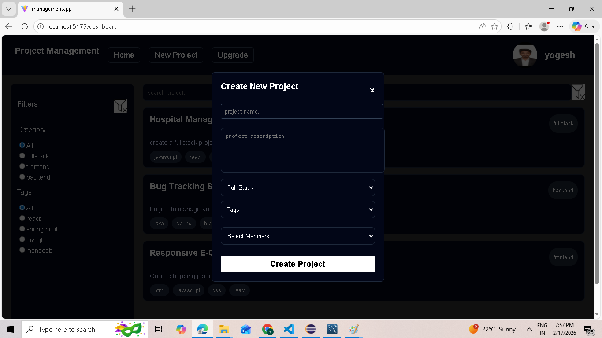
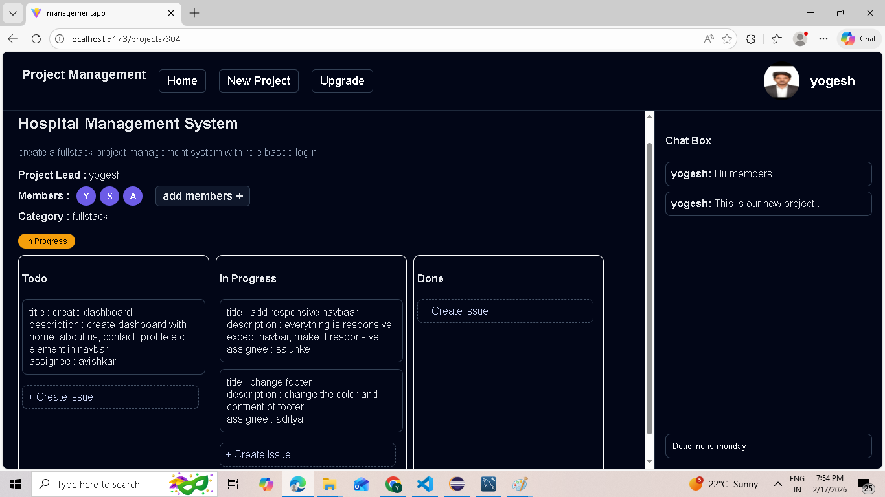
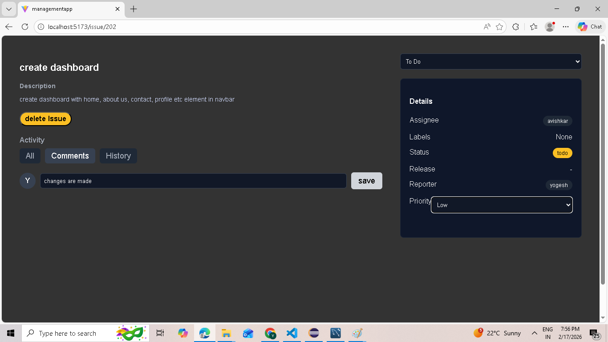
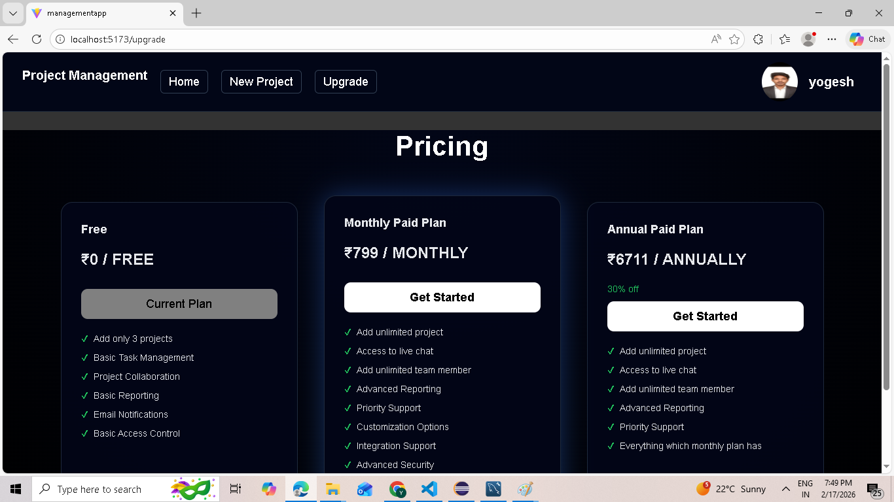

# Full Stack Project Management System

Live: [https://projectmanagement-ipbb.onrender.com](https://chatflow-pbbi.onrender.com/) · Repo: [https://github.com/YogeshSalunke-eng/ProjectManagementSystem]

A full-stack issue tracking system inspired by JIRA, built using Spring Boot and React (Vite).  
The application supports secure JWT authentication

---

## Table of Contents

- Motivation
- Tech Stack
- Features
- Screenshots
- Project Structure
- Setup & Installation
- Usage
- Environment Variables

---

## Motivation

This project was built to simulate a real-world issue tracking platform used by development teams. It helps manage tasks, assign issues, track progress, and maintain structured workflows within a secure and scalable architecture.
The goal was to implement enterprise-level backend security with JWT and integrate real-world services like email notifications

---

## 🚀Tech Stack

**Frontend:**

- React (with Vite)
- React Router
- Context API
- CSS

**Backend:**

- Spring Boot
- Spring Security
- JWT Authentication
- Maven
- MySQL
- Java Mail Sender
- Hibernate (JPA)

---

## 🔥Features

- User Registration & Login
- Secure JWT-based Authentication
- Role-based Authorization
- Create, Update, Delete Issues (CRUD)
- Assign Issues to Users
- Issue Status Tracking
- Email Notifications
- RESTful API Architecture
- Secure Password Encryption

---

## Screenshots


---

## 📸 Screenshots

### 🔐 Register Page


---

### 🔐 Login Page


---

### 📊 Dashboard


---

### 📁 Create Project


---

### 📂 Project Details


---

### 🐞 Issue Details


---

### 💳 Payment Page


---


## Project Structure

```
MyFullStackProject/
│
├── backend/
│ ├── src/main/java/
│ │ ├── controller/
│ │ ├── service/
│ │ ├── repository/
│ │ ├── model/
│ │ ├── security/
│ │ └── config/
│ ├── src/main/resources/
│ │ └── application.properties
│ ├── pom.xml
│ └── .gitignore
│
├── frontend/
│ ├── node_modules/
│ ├── public/
│ ├── src/
│ │ ├── assets/ # Images and static assets
│ │ ├── authentication/ # Login/Register logic
│ │ ├── components/ # Reusable UI components
│ │ ├── context/ # Global state management
│ │ ├── pages/ # Application pages
│ │ ├── subscription/ # Razorpay subscription/payment logic
│ │ ├── App.css
│ │ ├── App.jsx
│ │ ├── index.css
│ │ └── main.jsx
│ ├── .gitignore
│ ├── eslint.config.js
│ ├── index.html
│ ├── package.json
│ ├── package-lock.json
│ └── vite.config.js
│
└── README.md


```

---

## Setup & Installation

### Prerequisites

- Java 17+
- Maven
- Node.js (v18+ recommended)
- MySQL
- Gmail App Password (for email feature)

### 1. Clone the repository

```bash
git clone:-  https://github.com/YogeshSalunke-eng/ProjectManagementSystem
cd project management system
```

### 2. Backend Setup

```bash
cd backend
cp .env.example .env   # Fill in your environment variables
mvn clean  install
npm spring-boot:run          # Starts backend on http://localhost:8080
```

### 3. Frontend Setup

```bash
cd ../frontend
cp .env.example .env   # Set VITE_API_URL to your backend URL
npm install
npm run dev            # Starts frontend on http://localhost:5173
```

---


###Environment Variables

Before running the backend, configure the following environment variables:

- DB_USERNAME

- DB_PASSWORD

- JWT_SECRET

- MAIL_USERNAME

- MAIL_PASSWORD

## Usage

1. Register a new user account.
   
2.Login to receive JWT authentication.

3.Create new project and assign teammembers.

4.Create and assign issues.

5.Update issue status and details.

---

### Author

- Yogesh Salunke
- Full Stack Java Developer


